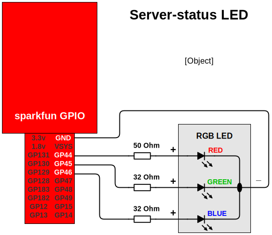
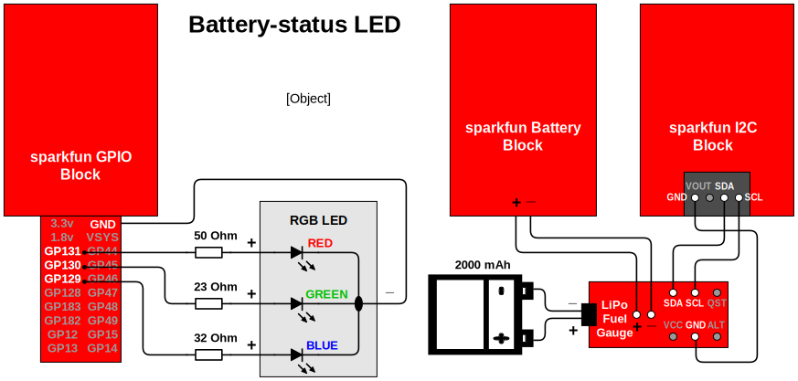

First we need to deactivate the Buendia Server to connect to LAN internet.  This is covered in more detail [here](https://github.com/projectbuendia/buendia/wiki/Setting-up-an-Edison).  To do this connect to the Edison using `screen`, as documented in setup.  You'll find yourself in _Yocto_, the branch of Linux designed for embedded projects like Edison.

(NB. note that the Buendia runs on a 'jailed' Debian OS which runs on top of Yocto. Its file system is accessible from Yocto via the path `/home/root/debian` or via the symlink (shortcut) folder `/debian`.  You can access Debian via a `chroot` operation (e.g. `chroot /home/root/debian/ /bin/bash`) or directly via `ssh` when Buendia server is running.)

Run the next 4 lines together:

    echo "NETWORKING_AP=0
    NETWORKING_DHCP_DNS_SERVER=0
    NETWORKING_SSID=yourwifinetwork
    NETWORKING_PASSWORD=yourwifinpassword" > /home/root/debian/usr/share/buendia/site/99-local
    
    reboot

When you're back up you can test the internet with `curl icanhazip.com`.

#### GPIO Setup

GPIO appears to only work from Yocto.  Yocto comes pre-installed with the necessary GPIO libraries, but does require an update.  Yocto's package manager (equivalent of `apt-get`) is `opkg`, and work's in pretty much the same way.

    echo "src mraa-upm http://iotdk.intel.com/repos/1.1/intelgalactic" > /etc/opkg/mraa-upm.conf
    opkg update
    opkg install libmraa0
    
    mkdir /home/root/gpio
    cd /home/root/gpio

### Prepare folders and scripts

Setup working folders

    mkdir /home/root/debian/home/buendia
    mkdir /home/root/debian/home/buendia/sd

Mount the SD card.  Append a line to debian's /etc/rc.local file (before 'exit') to mount the SD at /home/buendia/sd on startup:

    chroot /home/root/debian perl -0777 -i -pe 's/^exit 0/# mount SD card\nmount \/dev\/mmcblk1p1 \/home\/buendia\/sd\/ &\n\nexit 0/igm' /etc/rc.local

Check it looks right - should see `mount /dev/mmcblk1p1 /home/buendia/sd/ &` above `exit 0`

    tail /home/root/debian/etc/rc.local

Symbolic folder from Yocto to debian SD card folder

    ln -s /home/root/debian/home/buendia/sd /home/root/gpio/sd

Get the server-reporting Python script (requires chroot as git is only on Debian), and copy to working directory in Yocto:

    chroot /home/root/debian/ /bin/bash
    cd /home/buendia/sd
    git clone https://github.com/geotheory/server-status
    exit
    cd /home/root/gpio
    cp /home/root/gpio/sd/server-status/*.py /home/root/gpio
    chmod 755 /home/root/gpio/*.py

Now we'll configure a script to run on startup to which we can add our commands to run the LED python scripts.  This means creating a `.sh` file in `/etc/init.d` and telling Yocto to run it at startup:

    mkdir /etc/init.d
    cd /etc/init.d
    cp /home/root/gpio/sd/server-status/boot_script.sh ./boot_script.sh
    chmod 755 boot_script.sh

Add script to update-rc.d daemon:

    update-rc.d boot_script.sh defaults 99

(If you need to remove the script later the command is `update-rc.d -f boot_script.sh remove`.)

--------------------------

### Server Status LED

Modify the boot script so server status script will run.  Either use the `vi` editor to un-comment the line under `SERVER STATUS` or run the following line and check the result with `tail /debian/etc/rc.local`:

    perl -0777 -i -pe 's/# python \/home\/root\/gpio\/server_status.py/python \/home\/root\/gpio\/server_status.py/igm' boot_script.sh

The daemon will automatically update.

For server status we'll use the following pins to control an RGB LED (common cathode type). Note they're labelled differently on the GPIO block to the code:

| Label on GPIO Block  | pin # in code | RGB LED pin |
| ------------- | ------------- | ------------- |
| GP44  | 31  | red |
| GP45  | 45  | green |
| GP46  | 32  | blue |

This shows the schematic layout for the circuit.

Once connected you can test the circuit by manually running the `test_server_leds.py` script in the `test_scipts folder`.  If that works you're set up and on reboot the system should report.

#### Server-status LED colour codes

The server-status LED (RGB) reports Buendia's status in the following ways.  Some of these are determined 'externally' by Yocto and some by the status code that is output 'internally' from Buendia.

| State                          | Colour |
| -------------                  | ------------- |
| reboot                         | flashing blue/green slow |
| Tomcat up                      | flashing blue/green fast |
| OpenMRS up                     | green |
| Internal check: down           | flashing red very slow |
| Internal check: up             | green |
| Internal check: backup start   | flashing blue slow |
| Internal check: backing up     | flashing blue fast |
| Internal check: backing failed | flashing blue/red very slow |
| Update: checking for updates   | flashing green slow |
| Update: updating               | flashing green faster |
| Update: update failed          | flashing green/red very slow|

--------------------------

### Battery Status LED

Modify the boot script so battery status scripts will run.  Either un-comment the various lines with vi or run:

    cd /etc/init.d
    perl -0777 -i -pe 's/# echo 101/echo 101/igm' boot_script.sh
    perl -0777 -i -pe 's/# python \/home\/root\/gpio\/battery_status.py/python \/home\/root\/gpio\/battery_status.py/igm' boot_script.sh
    perl -0777 -i -pe 's/# \( sleep 15/\( sleep 15/igm' boot_script.sh

Now the hardware.  For an LED to report on battery level you'll need to purchase the [SparkFun LiPo Fuel Gauge](https://www.sparkfun.com/products/10617), as well as the [Sparkfun I2C Block](https://www.sparkfun.com/products/13034) to speak to it.

We'll use the following pins to control an RGB LED. Note again they're labelled differently on the GPIO block to the code:

| Label on GPIO Block  | pin # in code | RGB LED pin |
| ------ | --- | --- |
| GP131  | 35  | red |
| GP130  | 26  | green |
| GP129  | 25  | blue |

Connect the battery, LiPi Fuel Gauge and I2C Block as per the circuit diagram above.  This involves removing the 400 mAh battery that comes with the Battery Block and soldering in place connectors to link to the Fuel Gauge.  It is recommended to use detatchable connectors so the Edison stack or battery can be easily accessed if necessary.

--------------------------

### Reinstating the Buendia server

Setup is now complete.  Connect LED's to the GPIO as per the table above. Then revert the system to server mode:

    rm /home/root/debian/usr/share/buendia/site/99-local
    reboot

You should now see the LEDs you've enacted in operation.
